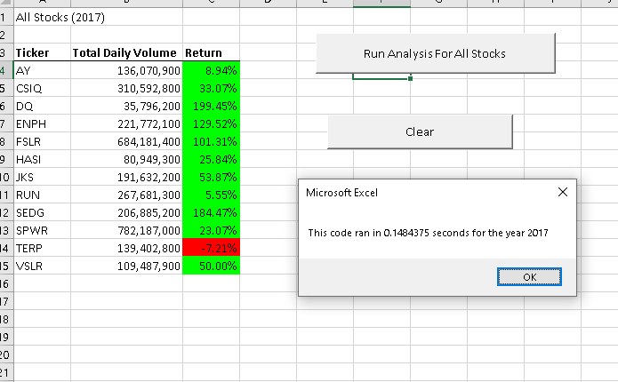
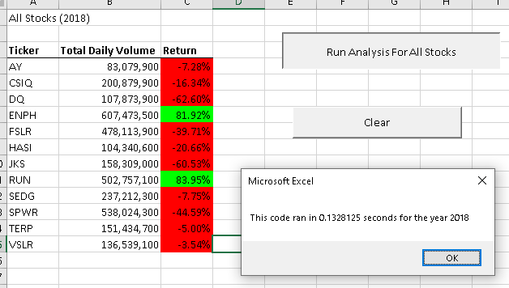
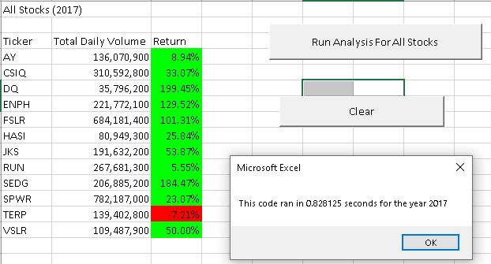
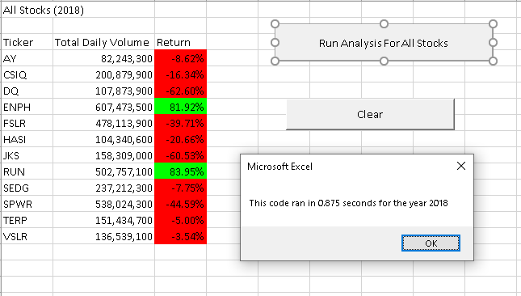

# Green Stock Analysis
## Overview
### Background
 A client is looking to help their family members invest in stock of a green company.  The family members are interested in the Daqo (DQ) company but the client would like to explore how other companies compare to ensure his family making sound investment.
 ### Purpose
 Two year's worth of green stock data will be analyzed to compare how actively it is traded and how well it returns.  There are 12 total green companies being compared.  VBA in Excel will be used to complete the analysis.  Macros were created to loop through the data to sum up the trade volumes for each company as well as pull the beginning and end of the year trade values to determine the return each company was getting.   The macros were refactored and timed to determine if there was an efficiency gain when running the data. 

The Excel workbook used to analyze this data can be found at this [LINK](VBA_Challenge.xlsm).

## Results
### 2017
In 2017, eleven out of the twelve companies showed an increase in returns however four of those companies showed returns of over 100%.  DQ had the highest return with 199.45% but was the least actively traded of all the companies.  

### 2018
This year was a poor year overall for green companies however two companies managed to have positive returns, RUN and ENPH.  ENPH was also the most actively traded company that year with RUN coming in as the 3rd most actively traded.  DQ was 3rd from last in active trading and performed the worst of all of the stocks with a return of -62.6%.

## Summary
When looking at just 2018, DQ does not appear to be a good company to invest in, however, after bringing in the 2017 data, DQ doesn't seem to be too bad of an option.  ENPH appears to be the best performing stock and would be the suggested choice for the client.  It did well in both 2017 and 2018, was very actively traded, and had the best average return over both years.  

In comparing the refactored macro (images above) to the original macro (images below), it was approximate .7 seconds faster with the refactored code. 

### 1. What are the advantages or disadvantages of refactoring code?
Advantages of refactoring code would be useful when you have a large dataset that is taking long time to run and you want to determine how to make it run more efficiently.  Additionally, it makes you try to think of the code from a different angle to find efficiencies.  This type of thinking can be helpful when a person needs to refactor someone else's code.  

Disadvantages to refactoring code could be that you might break what was once a working code.  Making sure to have a working history of your work to be able to be able to revert back to the last working code is important as it is very easy to get off track and introduce bugs.  

### 2. How do these pros and cons apply to refactoring the original VBA script?
While refactoring the original code that was working fine, I ran into multiple error codes and had to trouble shoot to determine the cause.  After significant time spent refactoring the code, less than a second was gained in the run time so for this particular case the time invested might not have been worth the end result. However, if a much larger dataset were to be used a bigger gain may be seen.   Learning to look at the code in different ways like was done with this builds skill that could be applicable to use in a real work setting where a person might need to refactor someone else's code.   

